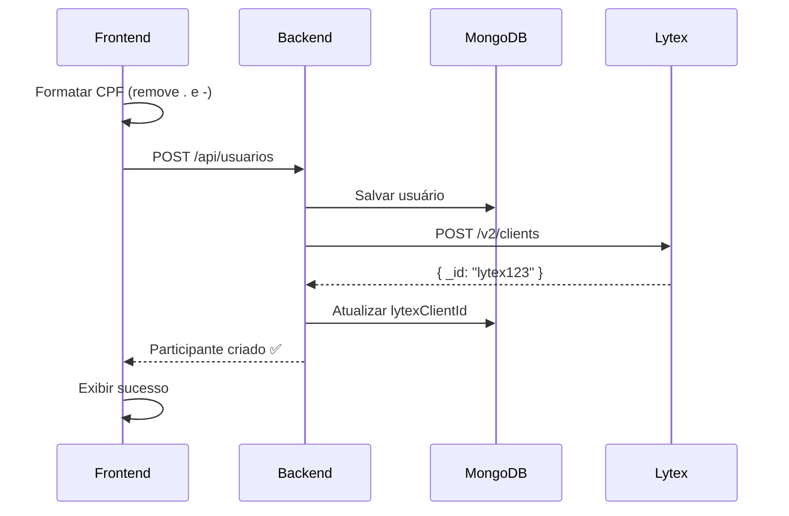
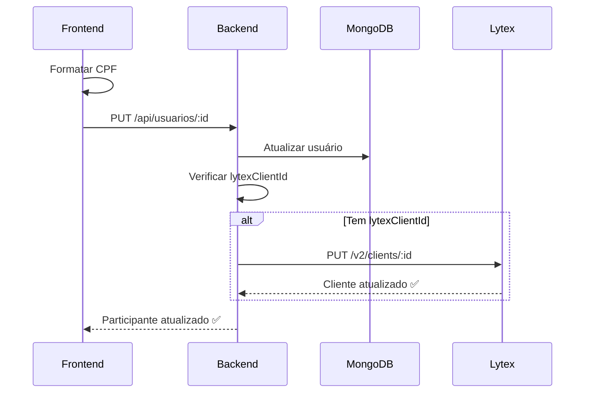
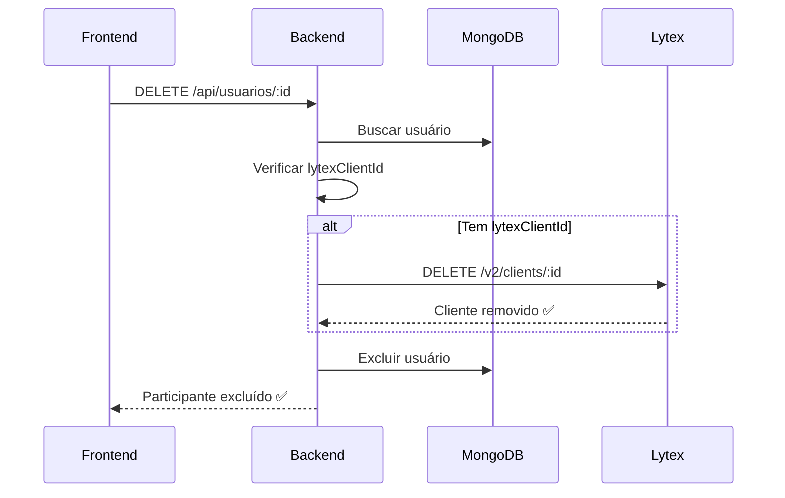

# Integração Completa com Lytex Pagamentos

## ✅ Implementações Realizadas

### 1. **Formatação Automática de CPF** ✅

#### Frontend (`Participantes.tsx`)
Adicionada função para remover automaticamente pontos e traços do CPF antes de enviar ao backend:

```typescript
// Função auxiliar para remover formatação do CPF
const formatCPF = (cpf: string): string => {
  return cpf.replace(/[^\d]/g, ''); // Remove tudo que não é dígito
};
```

**Aplicação**:
- ✅ `handleAdd`: Formata CPF ao adicionar participante
- ✅ `handleEdit`: Formata CPF ao editar participante

**Exemplo**:
```
Entrada: 212.526.653-93
Saída:   21252665393
```

---

### 2. **Sistema de Token Dinâmico** ✅

#### Backend (`lytex.service.ts`)
Implementado sistema para obter e renovar tokens automaticamente:

**Credenciais Sandbox**:
```typescript
clientId: '6938822ba3bcd5f5161a732b'
clientSecret: 'mzB9m5sWmtUd1NRazppjjE0ij2HMrkyaZkXWyC092xDJdDPYKPHXnf6OY48HLffCzLrZg1WZEJqpokgtye4WvCAWxCvmp4mwZ5qwVkDyGFAZrCqLuwIRwT7e4SHDVcfqVdR86VC2UA3JAbXqwBUCXuI74tlmiL6z4gIEfsaKyFXqBxxCDUPGelFrtS3huQJrrdzXDaAs3b61jkHZAzll6otffc1wihE4AToNFdQnvrbVtywRzC8dph2R4l2yV5S4'
baseUrl: 'https://sandbox-api-pay.lytex.com.br/v2'
```

**Funcionalidades**:
1. ✅ **Obtenção automática de token** na inicialização
2. ✅ **Renovação automática** antes de expirar (1 min de margem)
3. ✅ **Validação automática** antes de cada requisição
4. ✅ **Logs detalhados** para debugging

**Métodos implementados**:
```typescript
private async refreshToken(): Promise<void>
private async ensureValidToken(): Promise<void>
```

---

### 3. **Integração Completa CRUD** ✅

#### CREATE - Criar Cliente
**Fluxo**:
1. Participante adicionado no frontend
2. CPF formatado (pontos/traços removidos)
3. Enviado para `/api/usuarios` (MongoDB)
4. Se `tipo: 'usuario'` + CPF fornecido → integra com Lytex
5. `lytexClientId` salvo no MongoDB

**Exemplo de payload**:
```json
{
  "type": "pf",
  "name": "Monique",
  "cpfCnpj": "21252665393",
  "email": "monique@gmail.com",
  "cellphone": "7189899889",
  "address": {
    "street": "Rua Exemplo",
    "zone": "Centro",
    "city": "Salvador",
    "state": "BA",
    "number": "123",
    "zip": "40000000"
  }
}
```

**Log de sucesso**:
```
✅ Cliente criado no Lytex: 6938a1b2c3d4e5f6g7h8i9j0
```

---

#### UPDATE - Atualizar Cliente
**Fluxo**:
1. Participante editado no frontend
2. CPF formatado
3. Atualizado no MongoDB
4. Se `lytexClientId` existe → sincroniza com Lytex (PUT)

**Backend (`usuarios.service.ts`)**:
```typescript
async update(id: string, updateUsuarioDto: UpdateUsuarioDto): Promise<Usuario> {
  // ... atualiza MongoDB
  
  // Sincronizar com Lytex
  if (usuario.lytexClientId) {
    await this.lytexService.updateClient(usuario.lytexClientId, {
      name: usuario.nome,
      email: usuario.email,
      cellphone: usuario.telefone,
      cpfCnpj: usuario.cpf,
    });
  }
  
  return usuario;
}
```

---

#### DELETE - Remover Cliente
**Fluxo**:
1. Participante excluído no frontend
2. Se `lytexClientId` existe → remove do Lytex primeiro
3. Remove do MongoDB

**Backend (`usuarios.service.ts`)**:
```typescript
async remove(id: string): Promise<void> {
  const usuario = await this.usuarioModel.findById(id);
  
  // Remover do Lytex primeiro
  if (usuario.lytexClientId) {
    await this.lytexService.deleteClient(usuario.lytexClientId);
  }
  
  // Remover do MongoDB
  await this.usuarioModel.findByIdAndDelete(id);
}
```

---

## 🔄 Fluxo Completo de Integração

### Adicionar Participante



### Editar Participante



### Excluir Participante



---

## 📋 CURLs de Teste

### 1. Obter Token (Manual - para testes)
```bash
curl --location 'https://sandbox-api-pay.lytex.com.br/v2/auth/obtain_token' \
--header 'Content-Type: application/json' \
--data '{
  "grantType": "clientCredentials",
  "clientId": "6938822ba3bcd5f5161a732b",
  "clientSecret": "mzB9m5sWmtUd1NRazppjjE0ij2HMrkyaZkXWyC092xDJdDPYKPHXnf6OY48HLffCzLrZg1WZEJqpokgtye4WvCAWxCvmp4mwZ5qwVkDyGFAZrCqLuwIRwT7e4SHDVcfqVdR86VC2UA3JAbXqwBUCXuI74tlmiL6z4gIEfsaKyFXqBxxCDUPGelFrtS3huQJrrdzXDaAs3b61jkHZAzll6otffc1wihE4AToNFdQnvrbVtywRzC8dph2R4l2yV5S4"
}'
```

**Resposta**:
```json
{
  "accessToken": "eyJhbGciOiJIUzI1NiIsInR5cCI6...",
  "expiresIn": 1800
}
```

### 2. Adicionar Participante (via API CaixaJunto)
```bash
curl --location 'http://localhost:3000/api/usuarios' \
--header 'Content-Type: application/json' \
--data-raw '{
  "nome": "João da Silva",
  "email": "joao.silva@email.com",
  "senha": "Senha@123",
  "telefone": "71988741085",
  "cpf": "38234383795",
  "chavePix": "joao.silva@email.com",
  "tipo": "usuario"
}'
```

**Resposta esperada**:
```json
{
  "_id": "...",
  "nome": "João da Silva",
  "email": "joao.silva@email.com",
  "lytexClientId": "6938a1b2c3d4e5f6g7h8i9j0",
  "tipo": "usuario"
}
```

**Logs do backend**:
```
[LytexService] Obtendo novo token Lytex...
[LytexService] ✅ Token Lytex obtido com sucesso
[UsuariosService] Criando usuário: joao.silva@email.com, tipo: usuario, CPF: Sim
[UsuariosService] Tentando criar cliente no Lytex para joao.silva@email.com...
[LytexService] ✅ Cliente criado no Lytex: 6938a1b2c3d4e5f6g7h8i9j0
[UsuariosService] ✅ Cliente criado no Lytex: 6938a1b2c3d4e5f6g7h8i9j0 para usuário joao.silva@email.com
```

### 3. Editar Participante
```bash
curl --location --request PUT 'http://localhost:3000/api/usuarios/USUARIO_ID' \
--header 'Content-Type: application/json' \
--data-raw '{
  "nome": "João Silva Santos",
  "telefone": "71988741086"
}'
```

### 4. Excluir Participante
```bash
curl --location --request DELETE 'http://localhost:3000/api/usuarios/USUARIO_ID'
```

### 5. Listar Clientes no Lytex (Debug)
```bash
curl --location 'https://sandbox-api-pay.lytex.com.br/v2/clients' \
--header 'Authorization: Bearer SEU_TOKEN'
```

---

## 🔍 Verificação de Integração

### No Frontend
1. Acesse `/participantes`
2. Clique em "Adicionar Participante"
3. Preencha:
   - Nome: Monique
   - Email: monique@gmail.com
   - Telefone: 71989899889
   - CPF: `212.526.653-93` ← Com pontos e traço
   - Chave PIX: 212.526.653-93
4. Clique em "Adicionar"
5. Verifique a mensagem: **"Participante adicionado com sucesso e integrado ao Lytex!"**

### No Backend (Logs)
```bash
cd backend && npm run start:dev
```

**Logs esperados**:
```
[LytexService] Lytex Service inicializado em modo: SANDBOX
[LytexService] Obtendo novo token Lytex...
[LytexService] ✅ Token Lytex obtido com sucesso
[UsuariosService] Criando usuário: monique@gmail.com, tipo: usuario, CPF: Sim
[UsuariosService] Tentando criar cliente no Lytex para monique@gmail.com...
[LytexService] ✅ Cliente criado no Lytex: 6938xxxxxxxxxxxxx
[UsuariosService] ✅ Cliente criado no Lytex: 6938xxxxxxxxxxxxx para usuário monique@gmail.com
```

### No MongoDB
```bash
# Verificar se lytexClientId foi salvo
db.usuarios.findOne({ email: "monique@gmail.com" })
```

**Resposta esperada**:
```json
{
  "_id": "...",
  "nome": "Monique",
  "email": "monique@gmail.com",
  "cpf": "21252665393",  ← Sem formatação
  "lytexClientId": "6938xxxxxxxxxxxxx",  ← ID do Lytex
  "tipo": "usuario"
}
```

### No Lytex (Sandbox)
Verifique se o cliente foi criado acessando a API diretamente ou via painel Lytex.

---

## 🛡️ Tratamento de Erros

### Token Expirado
❌ **Problema**: Token expira a cada 30 minutos  
✅ **Solução**: Renovação automática antes de cada requisição

### Lytex Indisponível
❌ **Problema**: API Lytex fora do ar  
✅ **Solução**: Participante é criado localmente, integração falha silenciosamente (logs de erro)

### CPF Duplicado
❌ **Problema**: CPF já existe no MongoDB ou Lytex  
✅ **Solução**: Retorna erro 409 Conflict, frontend exibe modal de erro

### CPF Inválido
❌ **Problema**: CPF com formato incorreto  
✅ **Solução**: Frontend formata automaticamente, backend valida

---

## 🔧 Variáveis de Ambiente

### Backend (`.env`)
```env
# Lytex Pagamentos - Sandbox
LYTEX_BASE_URL=https://sandbox-api-pay.lytex.com.br/v2
LYTEX_CLIENT_ID=6938822ba3bcd5f5161a732b
LYTEX_CLIENT_SECRET=mzB9m5sWmtUd1NRazppjjE0ij2HMrkyaZkXWyC092xDJdDPYKPHXnf6OY48HLffCzLrZg1WZEJqpokgtye4WvCAWxCvmp4mwZ5qwVkDyGFAZrCqLuwIRwT7e4SHDVcfqVdR86VC2UA3JAbXqwBUCXuI74tlmiL6z4gIEfsaKyFXqBxxCDUPGelFrtS3huQJrrdzXDaAs3b61jkHZAzll6otffc1wihE4AToNFdQnvrbVtywRzC8dph2R4l2yV5S4
LYTEX_ENABLED=true
```

### Produção
Para usar em produção, atualize apenas as variáveis acima com as credenciais de produção.

---

## 📊 Status da Integração

| Operação | Frontend | Backend | Lytex | MongoDB |
|----------|----------|---------|-------|---------|
| **CREATE** | ✅ Formata CPF | ✅ Cria local + Lytex | ✅ Cliente criado | ✅ lytexClientId salvo |
| **READ** | ✅ Lista participantes | ✅ Busca MongoDB | N/A | ✅ Retorna dados |
| **UPDATE** | ✅ Formata CPF | ✅ Atualiza local + Lytex | ✅ Cliente atualizado | ✅ Sincronizado |
| **DELETE** | ✅ Confirma exclusão | ✅ Remove Lytex + MongoDB | ✅ Cliente removido | ✅ Excluído |

---

## 🎯 Próximos Passos

1. ✅ **Formatação de CPF**: Implementado
2. ✅ **Token dinâmico**: Implementado
3. ✅ **CRUD completo**: Implementado
4. 🔄 **Testes em produção**: Aguardando credenciais de produção
5. 🔄 **Webhooks Lytex**: A implementar (notificações de pagamento)
6. 🔄 **Split de pagamento**: A implementar (divisão automática)

---

## 🐛 Debug

### Habilitar logs detalhados
```typescript
// backend/src/common/lytex/lytex.service.ts
this.logger.debug(`Request: ${JSON.stringify(data)}`);
this.logger.debug(`Response: ${JSON.stringify(response.data)}`);
```

### Desabilitar integração temporariamente
```env
LYTEX_ENABLED=false
```

### Verificar token atual
```bash
# No backend
curl http://localhost:3000/api/usuarios
# Verificar logs para ver se token foi renovado
```

---

**Implementado por**: Sistema CaixaJunto  
**Data**: Dezembro 2024  
**Versão**: 2.3.0  
**Ambiente**: Sandbox → Produção (pendente)

